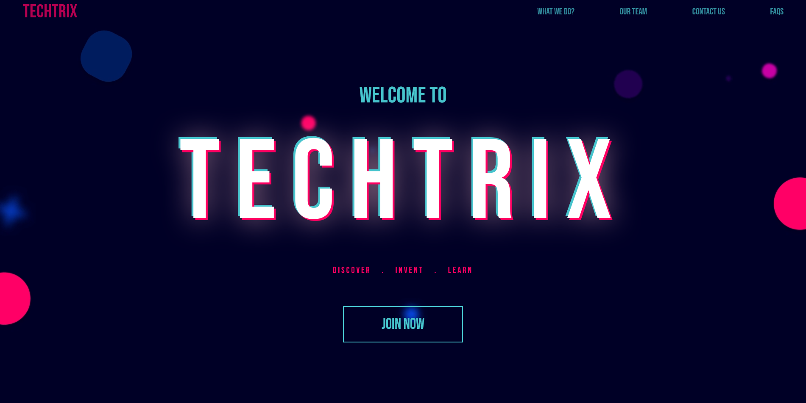

# CSI Web\<a>thon

Landing page website for CSI Hackathon.

- Written in pure HTML5 and CSS3
- Made use of CSS3 features like 2D and 3D transforms, animations, flexbox, grid, etc.  
- No use of JavaScript
- Design inspired by [Cyberpunk theme](https://en.wikipedia.org/wiki/Cyberpunk) and [Glitch effect](https://en.wikipedia.org/wiki/Glitch)
- Used [CSI VESIT](csivesit.org) website for inspiration as well. 